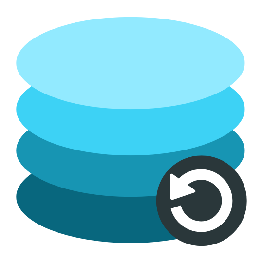

<p align="center">
  

  <h1 align="center">DBEaseBackup</h1>
  <p align="center">A tool designed to automate database backups to storage on a scheduled basis.</p>
  <p align="center">
    <a href="https://github.com/glennprays/dbeasebackup/actions/workflows/build-docker-image.yml"></a>
    <a href="https://hub.docker.com/r/glennprays/dbeasebackup"></a>
    
  </p>
</p>

## Supported Databases
- PostgreSQL
```
note: another database will be added soon!
```
## Storage
- Google Drive
```
note: another various storage will be added soon!
```
## How to use
Read detail in [Here](./example)

## License
MIT
